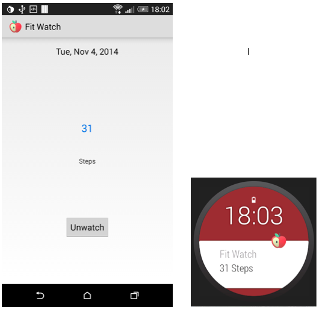
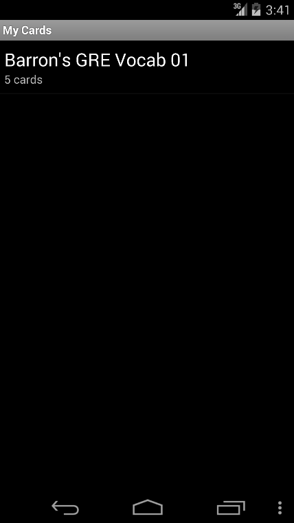
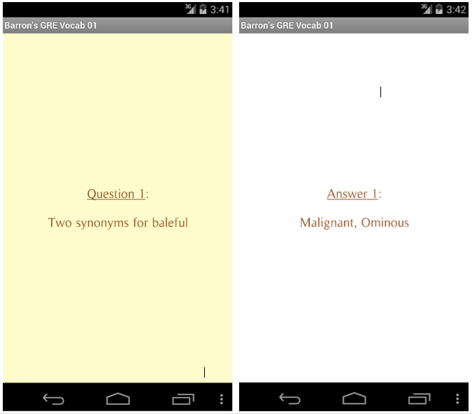
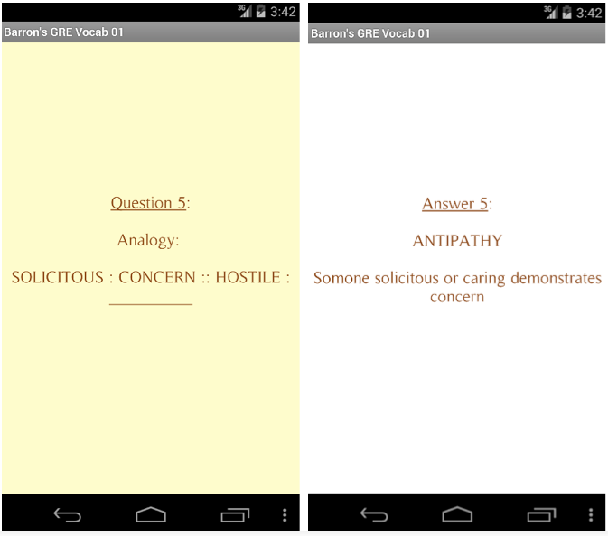

FitWatch
=====
This is an open source pedometer application for Android phones that do not have the [hardware step detector](https://developer.android.com/about/versions/kitkat.html) built in. Another feature of this application is that the steps count can be beamed to your Android wearable device by clicking on the 'Watch' button. The count will be displayed and updated in real-time on the watch.



*TODO:*

- Check accuracy of pedometer by comparing with FitBit 

FlashCards
=====
This is an open source flash cards application to aid learning. I personally built this application to help me revise during my exams. The cards can be created on your computer in a simple JSON format, as shown below. It consists of a *deck* JSON object that contains the title of the deck of cards. The *cards* are represented as a JSON array and each card is a JSON object consisting of a *question*, a *hint* and an *answer*. The strings in the card can be formatted using HTML tags.

```json
{
  "main": 
    {
       "title": "Barron's GRE Vocab 01"
    },
  "cards":
    [
      {
        "question": "Baleful (adjective)",
        "hint": "Context clue: a baleful glance",
        "answer": "Deadly; having a malign influence; ominous<p>Context sentence: a baleful glance</p>"
      },
      {
        "question": "Two synonyms for baleful",
        "hint": "Think cancer tumour that is harmful; also think something really bad that is about to happen",
        "answer": "Malignant, Ominous"
      },
      {
        "question": "Antipathy (noun)",
        "hint": "Context clue: Natural antipathy of cats and dogs",
        "answer": "Habitual aversion; intense dislike; natural repugnance; hatred<p>Anti means against; path means feeling</p>"
      },
      {
        "question": "Analogy: <p>SOLICITOUS : CONCERN :: HOSTILE : __________</p>",
        "hint": "Think of strong dislike or hatred",
        "answer": "ANTIPATHY<p>Somone solicitous or caring demonstrates concern</p>"
      },
      {
        "question": "Macabre (adjective)",
        "hint": "Context clue: a macabre ending",
        "answer": "gruesome and horrifying, ghastly; representing death<p>Pronounciation: muh-kah-bruh</p>"
      }
    ]
}
```
Once these cards are created, they have to be copied onto the SD storage of the device in the *FlashCards* folder. When the application is opened on the device, it processes all the JSON files in the *FlashCards* folder and persists each deck into an SQLite database. 

The following screenshots show how the JSON file is processed and displayed in the Android application. The cards in the deck are randomised every time the deck is opened in the app.







*TODO:*

- Implement the [Leitner](http://en.wikipedia.org/wiki/Leitner_system) system to improve how the cards are displayed. Cards have to be reviewed at increasing interval.

Remotainment
=====
This is an open source remote controller application for the VLC media player. It consists of a server application that runs on your computer and interfaces with VLC and an Android application that interfaces with the server app.

### Remotainment Server

### Remotainment Android App (*Work in Progress*)